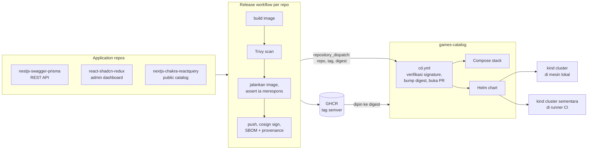
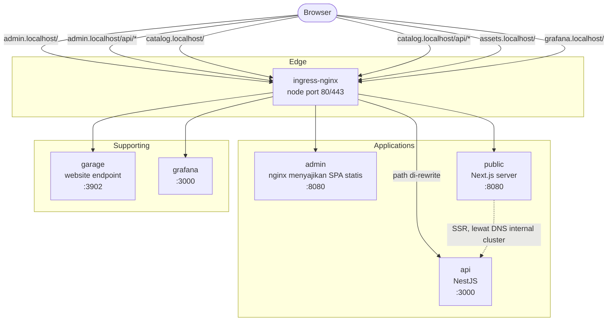
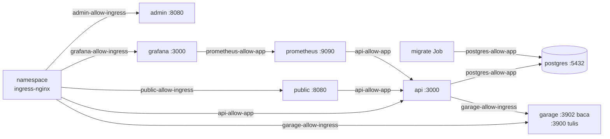
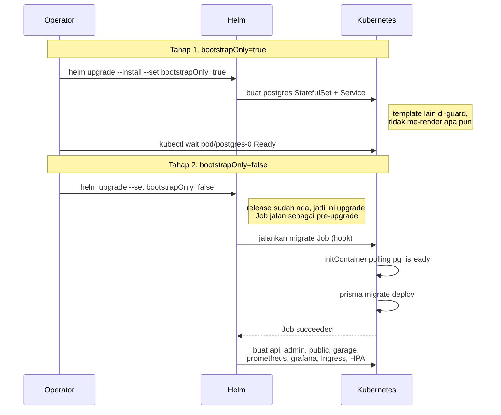
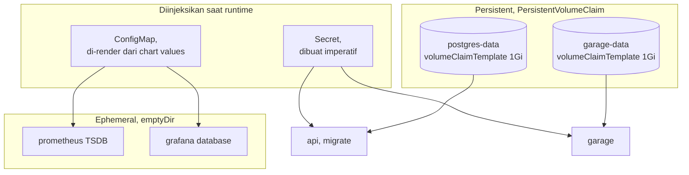
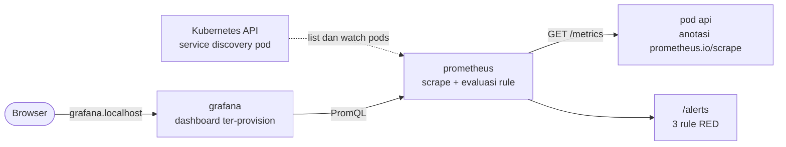

# Architecture

Tujuh sudut pandang atas sistem yang sama, dari luar ke dalam. Tiap bagian menjawab pertanyaan yang berbeda, jadi tidak ada yang diulang: dari mana artefaknya berasal, bagaimana request sampai ke aplikasi, apa yang boleh bicara dengan apa, bagaimana sebuah rilis di-rollout, di mana state disimpan, bagaimana sistemnya diamati, dan apa yang berbeda antara stack development dan cluster.

Yang dijelaskan di sini berjalan di cluster kind, di mesin lokal maupun di dalam runner CI; batas cakupannya diuraikan di bagian scope pada [README.md](README.md). Komponen yang sudah ter-deploy tapi belum dipakai disebutkan statusnya secara eksplisit.

---

## 1. Ecosystem

Repo ini tidak memuat source code aplikasi. Tiga repo terpisah mem-build dan mem-publish image masing-masing; repo ini memakainya lewat digest lalu men-deploy-nya.

**Chart yang sama di-deploy ke dua tempat.** Cluster lokal dipakai operator, cluster di runner dibuat dan dibuang tiap push sebagai regresi. Keduanya menarik digest yang sama dari GHCR, jadi yang diuji runner adalah artefak yang sama dengan yang dijalankan lokal. Cakupan pemeriksaan runner ada di [README.md](README.md).

**Kenapa trigger lintas-repo memakai token GitHub App.** Token bawaan yang dipegang sebuah workflow tidak memicu workflow run di repo lain. Batasan itu ada supaya workflow tidak bisa saling memicu tanpa henti, dan tidak bisa dilewati dengan konfigurasi. Dispatch karena itu diautentikasi dengan token instalasi GitHub App, satu-satunya opsi yang tidak terikat akun pribadi dan tidak kedaluwarsa berkala ([dokumentasi GitHub](https://docs.github.com/en/actions/how-tos/write-workflows/choose-when-workflows-run/trigger-a-workflow)).

Batasan yang sama muncul lagi satu tingkat ke dalam: pull request yang dibuka dengan token bawaan juga tidak memicu cek apa pun. Karena PR bump baru berguna kalau lint chart dan deploy ke kind benar-benar berjalan di atasnya, token App dipakai sejak checkout, bukan hanya pada perintah yang membuat PR-nya. Token yang dipakai `git push` ditentukan saat checkout, dan branch yang di-push dengan token bawaan tetap menghasilkan PR tanpa cek.

**Kenapa dispatch dikirim setelah image di-sign, bukan setelah push.** Yang diverifikasi di sisi penerima adalah signature, jadi image yang belum ditandatangani tidak punya apa pun untuk diperiksa. Urutan itu membuat rilis yang gagal menandatangani berhenti di repo asalnya.

**Kenapa identitas signer diikat, bukan sekadar keberadaan signature.** Keyless signing meng-issue sertifikat berumur pendek yang memuat identitas signer-nya, yaitu URL workflow ditambah ref yang menjalankannya. Verifikasi yang hanya menanyakan "ada signature yang valid" akan menerima image yang ditandatangani siapa pun lewat mekanisme yang sama, jadi yang diminta adalah identitas persis workflow rilis repo itu pada tag itu.

**Kenapa workflow rilis menjalankan image sebelum mem-push-nya.** Build hijau dan scan bersih tidak membuktikan container bisa start. Dua image API pernah terbit dalam keadaan tidak bisa start, keduanya lolos build dan scan. Yang menangkapnya adalah langkah yang benar-benar menjalankan container lalu meminta respons darinya, dan langkah itu sekarang ada di ketiga workflow rilis.

Compose file dan chart values sama-sama memuat `repository:tag@sha256:...`, sehingga tag tetap terbaca manusia sementara digest yang menentukan apa yang ditarik. Alasan memilih digest ada di [DECISION.md](DECISION.md).

---

## 2. Request path

Routing berbasis hostname. Tiap frontend memegang virtual host sendiri di root, dan API dipasang di `/api` pada kedua host, sehingga browser bicara ke satu origin per aplikasi dan tidak pernah melakukan request lintas-origin.

**Kenapa `/api` butuh objek Ingress sendiri.** Anotasi rewrite berlaku untuk satu objek Ingress secara utuh. Path API perlu rewrite, misalnya `/api/health` harus sampai ke backend sebagai `/health`, sementara path frontend tidak boleh di-rewrite. Keduanya tidak bisa berada di objek yang sama, jadi `admin`, `public`, dan `api` masing-masing punya objek sendiri.

**Kenapa aplikasi publik punya jalur kedua ke API.** Route yang di-render di server melakukan HTTP request dari dalam container, tempat `/api` yang relatif terhadap browser tidak berarti apa-apa. Jalur itu memakai nama Service internal cluster. Satu env per arah: `API_URL` untuk browser, `API_BACKEND_INTERNAL` untuk server.

**Kenapa tidak ada hostname yang di-bake ke dalam image frontend.** Vite dan Next.js sama-sama menanam nilai env publik saat build, yang akan mengikat satu image ke satu environment. Kedua image karena itu menulis file config kecil saat container start dan membacanya sebelum aplikasi bootstrap, sehingga digest yang sama jalan di mana pun.

`*.localhost` resolve ke loopback di browser dan curl tanpa entri hosts file ([RFC 6761](https://www.rfc-editor.org/rfc/rfc6761)).

---

## 3. Network isolation

Satu aturan default-deny tingkat namespace memblokir seluruh ingress ke pod. Tiap panah di bawah adalah satu NetworkPolicy yang membuka tepat satu sumber, satu tujuan, dan satu port.

**Cakupan aturan default-deny.** Isinya hanya `policyTypes: [Ingress]`. Ingress ke pod yang tidak disebut di atas ditolak; egress dari pod tidak dibatasi sama sekali. Probe dari kubelet tetap sampai ke pod dengan aturan ini terpasang.

**Policy ini di luar Helm chart, jadi `helm upgrade` tidak meng-apply-nya.** Policy yang berubah butuh `kubectl apply` sendiri. Policy yang terlewat muncul sebagai gateway timeout, bukan connection refused, karena paketnya di-drop di jaringan dan tidak pernah ditolak aplikasi. Alasan penempatannya di [DECISION.md](DECISION.md).

**Dua port Garage melayani dua arah yang berbeda.** Port 3902 menyajikan objek ke browser tanpa kredensial dan punya Ingress. Port 3900 menerima tulisan dari `api` dengan kredensial dan tidak punya Ingress; satu-satunya yang boleh menjangkaunya adalah pod berlabel `app: api`, lewat aturan kedua di policy yang sama. Pemisahan ini bukan pilihan gaya: Garage memakai izin per-access-key-per-bucket dan bukan ACL S3, sehingga akses baca publik memang ditangani endpoint website terpisah, bukan dengan membuat bucket public-read.

Konsekuensinya untuk bentuk data: database menyimpan object key, bukan URL. URL dirakit saat response disusun, dari base URL yang datang dari env. Host penyimpanan karena itu bisa berubah antar-target tanpa menyentuh satu baris data pun, yang merupakan syarat portabilitas yang sama seperti larangan mem-*bake* hostname ke dalam image.

**Avatar default diunggah aplikasi saat registrasi pertama.** Tiap baris pengguna baru merujuk satu objek yang harus ada. Objeknya ikut di dalam image dan diunggah pada registrasi pertama tiap proses, hanya kalau pemeriksaan keberadaannya menjawab 404; hasilnya di-cache di memori. Ini menghindari langkah bootstrap manual yang harus diulang di tiap target, dan sengaja tidak dijalankan saat start supaya proses tetap bisa naik tanpa object storage.

---

## 4. Deployment lifecycle

Prisma tidak mendukung migrasi konkuren dari proses terpisah, jadi migrasi dijalankan sekali, di Job-nya sendiri, sebelum pod aplikasi mana pun start. Di Helm itu berarti hook `pre-install,pre-upgrade`.

Hook itu menimbulkan masalah urutan di cluster yang benar-benar kosong. Helm menjalankan hook `pre-install` sebelum **semua** resource non-hook di release tersebut ([dokumentasi Helm](https://helm.sh/docs/topics/charts_hooks/)), termasuk PostgreSQL, yang di chart ini adalah resource biasa. Pada instalasi pertama, migrasi akan start tanpa database yang bisa di-connect.

`bootstrapOnly` adalah templating kondisional biasa: yang berubah hanya template mana yang di-render, semantik hook tidak disentuh. Alternatif yang ditolak ada di [DECISION.md](DECISION.md).

**Kenapa tetap ada initContainer.** Helm menjamin urutan pembuatan resource, bukan kesiapan pod di baliknya. InitContainer pada Job melakukan polling `pg_isready` sampai database menjawab ([pola init container](https://kubernetes.io/docs/concepts/workloads/pods/init-containers/)).

**Rilis setelah yang pertama cukup satu `helm upgrade`.** Nilai default `bootstrapOnly` adalah false. Satu hal yang perlu diketahui: `--set` dari revisi sebelumnya terbawa ke upgrade berikutnya yang tidak menyebutkannya, jadi flag ini selalu ditulis eksplisit dan tidak pernah mengandalkan default.

**Pre-pull image besar sebelum instalasi pertama.** Timeout hook dipegang client `helm`, bukan controller Kubernetes. Kalau pull image pertama kali melampauinya, proses `helm` keluar sementara Job-nya tetap berjalan sampai selesai di background. Karena hook cleanup policy adalah logika sisi client, tidak ada yang menghapus Job yang sudah selesai itu sampai `helm upgrade` berikutnya dijalankan.

---

## 5. State

**Stack yang dibangun ulang naik dengan skema ter-migrasi dan tabel kosong.** Job migrasi menjalankan `prisma migrate deploy`, yang tidak menjalankan seed, dan skrip seed-nya sendiri tidak ada di image produksi karena runner-nya ikut terbuang saat dependency dev di-prune. Isi demo dibuat lewat aplikasinya setelah itu.

**`DATABASE_URL` dikomposisi di dalam pod, tidak disimpan sebagai Secret terpisah.** Nilainya dirangkai dari Secret kredensial yang sama dengan yang dipakai PostgreSQL, lewat interpolasi antar-env dalam satu container, sehingga kredensial tidak pernah diduplikasi ke objek kedua.

Alasan memilih emptyDir untuk monitoring, data demo tanpa backup, dan Secret imperatif ada di [DECISION.md](DECISION.md).

**PostgreSQL 18 me-mount volume di `/var/lib/postgresql`, bukan `/var/lib/postgresql/data`.** Tata letak direktori data berubah di major version tersebut ([docker-library/postgres#1259](https://github.com/docker-library/postgres/pull/1259)).

---

## 6. Observability

**Cara target ditemukan.** Prometheus memantau Kubernetes API untuk daftar pod, lalu menyaring yang membawa anotasi scrape lewat aturan relabeling. Tidak ada custom resource dan tidak ada operator yang harus jalan lebih dulu.

**Kenapa Prometheus satu-satunya workload yang memegang token API.** Semua yang lain berjalan dengan `automountServiceAccountToken: false`. Prometheus butuh auth ke API server untuk discovery pod, jadi ia mendapat ServiceAccount dengan ClusterRole yang dibatasi pada `get`, `list`, dan `watch` untuk pods saja.

**Alert rule dievaluasi tapi tidak dikirim ke mana pun.** Ada tiga rule RED: error rate di atas 5%, p95 latency di atas satu detik, dan API tidak reachable. Tanpa Alertmanager, yang terlihat hanya firing state di halaman alerts Prometheus. Alasannya di [DECISION.md](DECISION.md).

**Grafana di-provision dari file.** Datasource, dashboard provider, dan JSON dashboard-nya sama-sama di-mount dari ConfigMap yang di-render chart, jadi dashboard-nya lahir dari deploy dan tidak diekspor manual.

**metrics-server terpisah dari semua ini.** HPA membaca CPU dari metrics-server, bukan dari Prometheus, dan metrics-server dipasang di luar chart. Tanpa itu objek HPA tetap ada tapi melaporkan utilisasi `<unknown>` dan tidak akan scale.

---

## 7. Compose vs Kubernetes

Compose stack adalah target development. Topologinya sama, mekanismenya lebih sederhana, dan karena itu masalah cenderung muncul di sana lebih dulu dengan biaya perbaikan yang lebih murah.

| Aspek | Compose | Kubernetes |
|---|---|---|
| Routing di edge | container `nginx`, config di-mount dari file, host port 8080 | ingress-nginx, objek `Ingress`, node port 80/443 |
| Service discovery | DNS network Docker | DNS Service Kubernetes |
| Urutan migrasi | service `migrate` plus `depends_on: service_completed_successfully` | Job sebagai hook Helm `pre-install,pre-upgrade` |
| Gating kesiapan | `healthcheck` container plus `depends_on: service_healthy` | `readinessProbe` dan `livenessProbe` di ketujuh workload yang berjalan terus, plus `startupProbe` pada Grafana |
| Persistence | named volume | `PersistentVolumeClaim` lewat `volumeClaimTemplates` |
| Isolasi | satu user-defined network, capability di-drop, `no-new-privileges`, PID limit | `NetworkPolicy`, Pod Security Admission `restricted`, `securityContext` per container |
| Scaling | tidak dicakup | HPA berbasis CPU, 1 sampai 5 replica |
| Monitoring | tidak dicakup | Prometheus dan Grafana di dalam chart |
| Konfigurasi | file `.env` | Secret dan chart values |

Kedua target menarik digest image yang sama, dan keduanya butuh satu perintah Garage yang sama setiap volume dibuat ulang, dengan alasan yang identik: mengaktifkan akses website publik pada sebuah bucket memerlukan node key yang tersimpan di metadata directory node yang sedang berjalan, dan container terpisah tidak bisa menjangkaunya.
