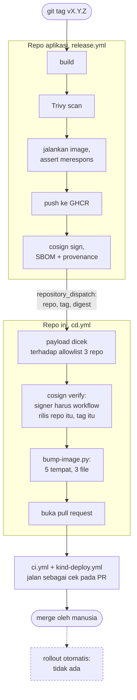

# Release

Bagaimana rilis di salah satu repo aplikasi berjalan sampai masuk ke repo ini. Mekanisme di balik tiap pilihannya, termasuk kenapa trigger lintas-repo memakai token GitHub App dan kenapa yang diverifikasi adalah identitas signer, ada di [ARCHITECTURE.md](ARCHITECTURE.md#1-ecosystem).

## Rantainya

Ketiga aplikasi merilis image-nya sendiri dari repo masing-masing. Repo ini bereaksi terhadap rilis itu.

| Urutan | Di mana | Yang terjadi | Yang menghentikannya kalau gagal |
|---|---|---|---|
| 1 | repo aplikasi | Tag `vX.Y.Z` menjalankan workflow rilis: build, scan Trivy, jalankan image dan assert ia merespons, push, cosign sign, SBOM dan provenance | Gate scan dan gate run image. Image yang tidak bisa start tidak pernah sampai ke registry |
| 2 | repo aplikasi | `repository_dispatch` dikirim ke repo ini berisi nama repo, tag, dan digest | Dispatch berada setelah image di-sign, jadi image yang belum di-sign tidak pernah dikirim |
| 3 | repo ini, `cd.yml` | Payload divalidasi terhadap daftar tiga repo yang dikenal | Payload di luar daftar ditolak |
| 4 | repo ini, `cd.yml` | Signature image diverifikasi. Yang diperiksa bukan keberadaan signature, melainkan bahwa signer-nya adalah workflow rilis repo itu pada tag itu | Verifikasi gagal, rantai berhenti |
| 5 | repo ini, `cd.yml` | Digest baru disunting ke seluruh tempat ia dipin, lalu dibuka sebagai pull request | Skrip bump menolak selesai kalau masih ada digest lama tersisa |
| 6 | repo ini, PR | Lint chart, asersi render, dan deploy ke cluster kind berjalan sebagai cek pada PR itu | Cek merah, PR tidak layak merge |

## Di mana rantainya berhenti

Di pull request. Tidak ada `helm upgrade` otomatis, karena tidak ada cluster yang berjalan permanen untuk dituju; alasannya ada di bagian scope pada [README.md](README.md). PR-nya di-review dan di-merge manusia.

Konsekuensi yang perlu dibaca apa adanya: selama pull request belum di-merge, digest yang tercatat di repo berbeda dari digest yang terakhir dirilis. Ini belum continuous deployment dalam arti penuh.

## Kenapa penyuntingan digest butuh skrip

Satu digest dipin di tiga file dengan dua bentuk berbeda: dua key terpisah di chart values, dan satu string `repo:tag@digest` utuh di Compose file serta di dua tempat pada skrip clean-slate. Lima tempat untuk satu nilai.

Penyuntingannya karena itu dilakukan [`.github/scripts/bump-image.py`](.github/scripts/bump-image.py), yang dipanggil dari `cd.yml` dan bisa dijalankan manual. Skrip itu menolak menyelesaikan pekerjaan kalau masih ada digest lama yang tersisa, sehingga tidak mungkin separuh tempat ter-update dan separuh tidak.

Penggantian menarget string `repo:tag@digest` utuh, bukan digest telanjang. Ini yang membuat image lain yang kebetulan punya digest sama tidak tersentuh.
