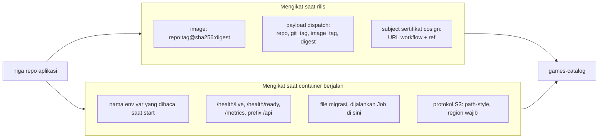

# Structure

Isi repo ini dan siapa yang memiliki apa. Bagian kedua menjawab pertanyaan yang lebih sering muncul: di titik mana repo ini bertemu ketiga repo aplikasi, dan dalam bentuk apa.

Yang didaftar di sini hanya yang menentukan bentuk infrastruktur. File pendukung yang isinya jelas dari namanya tidak diulang.

## Peta direktori

```
compose/
  docker-compose.yml       7 service: postgres, migrate, api, admin, public, proxy, garage
  nginx.conf               3 virtual host, mengisi peran ingress-nginx di stack development
  garage.toml              konfigurasi object storage, file statis
  .env.example             10 nilai rahasia tanpa isinya: 8 dipakai kedua target, 2 kredensial Grafana hanya di cluster

k8s/
  kind-config.yaml         node image dipin ke digest, port 80 dan 443 dipetakan ke host
  namespace.yaml           label Pod Security Admission restricted
  ingress-nginx/deploy.yaml   manifest upstream, di-vendor apa adanya
  network-policies/        8 file, satu default-deny plus 7 pembuka jalur
  k6/load-test.js          skenario beban, sekaligus gate lewat threshold
  chart/
    Chart.yaml
    values.yaml            satu-satunya tempat perbedaan antar-target dinyatakan
    templates/             25 file, merender 29 objek
    files/prometheus/      scrape config dan alert rule, dibaca chart lewat .Files.Get
    files/grafana/         datasource, dashboard provider, dashboard JSON

.github/
  workflows/ci.yml         lint chart dan asersi render, tanpa cluster
  workflows/kind-deploy.yml  cluster kind di dalam runner, deploy, cek endpoint
  workflows/cd.yml         penerima rilis lintas-repo
  scripts/bump-image.py    penyunting digest, dipakai cd.yml dan bisa manual

scripts/
  clean-slate-test.sh      hapus total lalu bangun ulang keduanya, dengan asersi
  output.txt               log run sukses terakhir, ikut di-commit sebagai bukti
```

Angka di kolom kanan berasal dari isi repo: 7 service dari `image:` di `compose/docker-compose.yml`, 3 virtual host dari `server_name` di `compose/nginx.conf`, 8 file dari `ls k8s/network-policies/`, 25 file dan 29 objek dari jumlah file template dan jumlah baris `kind:` di dalamnya, 10 nilai dari baris `NAMA=` di `compose/.env.example`.

Yang perlu dibedakan soal `.env.example`: isinya hanya nilai rahasia, yaitu kredensial PostgreSQL, JWT secret, empat nilai Garage, dan kredensial Grafana. Konfigurasi non-rahasia seperti nama bucket, endpoint S3, dan region ditulis literal di Compose file dan chart values, jadi tidak ada nilai yang harus diisi dua kali.

## Kenapa sebagian manifest berada di luar chart

| Berada di luar chart | Alasannya |
|---|---|
| `k8s/network-policies/` | Hook `pre-install` Helm berjalan sebelum resource non-hook mana pun. NetworkPolicy yang masuk chart belum ada saat Job migrasi menghubungi database, jadi instalasi ke cluster kosong gagal |
| `k8s/ingress-nginx/deploy.yaml` | Infra cluster, siklus hidupnya tidak terikat rilis aplikasi |
| `k8s/namespace.yaml` | Harus ada sebelum Pod pertama supaya admission benar-benar menolak, bukan sekadar memperingatkan |
| `k8s/kind-config.yaml` | Dibaca `kind`, bukan `kubectl` atau `helm` |

Konsekuensi yang harus diingat saat memakai: `helm upgrade` tidak meng-apply NetworkPolicy. Rincian trade-off-nya di [DECISION.md](DECISION.md).

## Berkas yang paling menentukan

| File | Kalau salah, gejalanya |
|---|---|
| `k8s/chart/values.yaml` | satu nilai keliru menggulirkan seluruh stack, karena semuanya satu Helm release |
| `k8s/network-policies/` | bukan error yang jelas, melainkan timeout, karena paket di-drop di jaringan dan tidak pernah sampai ke aplikasi |
| `compose/.env` | satu-satunya sumber nilai secret untuk kedua target, dan tidak ada di repo |
| `scripts/clean-slate-test.sh` | satu-satunya yang membuktikan semuanya bisa dibangun ulang dari nol |

## Titik temu dengan repo aplikasi

Empat repo, dan seluruh sambungannya hanya tujuh. Selain tujuh ini tidak ada ketergantungan: repo ini tidak pernah membaca source code aplikasi, dan repo aplikasi tidak pernah membaca manifest di sini.

Ketujuhnya terbagi dua menurut kapan ia mengikat, dan pembagian itu menentukan kapan kesalahannya ketahuan. Sambungan yang mengikat saat rilis gagal di pipeline, terlihat sebagai workflow merah. Sambungan yang mengikat saat container berjalan tidak gagal di pipeline sama sekali; ia gagal setelah deploy.



Dua hal yang perlu dibaca dari pembagian itu. Pertama, empat sambungan di lajur bawah tidak punya pemeriksa otomatis: kalau aplikasi mengganti nama variabel env atau memindahkan endpoint health, tidak ada yang merah sampai pod gagal start di cluster. Kedua, semua panah searah, dan itu bukan kebetulan gambar: repo aplikasi tidak pernah menaut balik ke manifest di sini, sehingga ketiganya tetap bisa dipakai tanpa repo ini sama sekali.

| Sambungan | Bentuk konkretnya | Sisi repo aplikasi | Sisi repo ini |
|---|---|---|---|
| Artefak image | `ghcr.io/<owner>/<repo>:<tag>@sha256:<digest>` | `Dockerfile` dan workflow rilis yang mem-build lalu push | `k8s/chart/values.yaml` dan `compose/docker-compose.yml`, dipin ke digest |
| Trigger rilis | `repository_dispatch` bertipe `app-released`, payload berisi `repo`, `git_tag`, `image_tag`, `digest` | step dispatch di workflow rilis, dikirim setelah `cosign sign` | `.github/workflows/cd.yml`, memvalidasi bentuk keempat field sebelum memakainya |
| Identitas signature | subject sertifikat keyless, yaitu URL workflow rilis ditambah ref tag | workflow yang menandatangani | `cosign verify` dengan `--certificate-identity` eksak di `cd.yml` |
| Konfigurasi runtime | nama variabel env yang dibaca aplikasi saat container start | kode yang membaca env, dan untuk kedua frontend, entrypoint yang menulis file config sebelum bootstrap | env di chart templates dan di Compose file, nilainya dari values dan `.env` |
| Kontrak HTTP | `/health/live`, `/health/ready`, `/metrics`, dan prefix `/api` | endpoint yang disediakan aplikasi | probe di Deployment, scrape config Prometheus, dan rewrite di objek Ingress `api` |
| Skema database | file migrasi Prisma | `prisma/migrations/`, bagian dari source code | `k8s/chart/templates/migrate-job.yaml` yang menjalankan `prisma migrate deploy`, dan service `migrate` di Compose |
| Object storage | protokol S3 dengan path-style dan region wajib untuk tanda tangan SigV4 | kode upload memakai klien S3 generik | Garage, `garage.toml`, dan enam variabel env S3 pada `api` |

### Aturan yang menentukan sisi mana memiliki apa

Batasnya jenis artefak, bukan topik.

| Di repo aplikasi | Di repo ini |
|---|---|
| `Dockerfile`, `.dockerignore` | manifest Kubernetes, Compose file |
| endpoint health dan metrics, instrumentasi | server Prometheus, alert rule, dashboard Grafana |
| CI: lint, test, build image, push bertag semver | deploy dan rollout |
| file migrasi | manifest Job yang menjalankan migrasi |
| tidak ada | secret handling, ingress, scaling, TLS |

Contoh yang paling sering disalahpahami: migrasi database punya *file*-nya di repo backend karena itu bagian dari source code, tapi *cara menjalankannya* ada di sini karena itu bagian dari deploy. Topik sama, artefak beda, rumah beda.

## Repo aplikasi

| Repo | Peran | Yang dikonsumsi repo ini |
|---|---|---|
| [nestjs-swagger-prisma](https://github.com/qrizan/nestjs-swagger-prisma) | REST API | image, endpoint health dan metrics, file migrasi |
| [react-shadcn-redux](https://github.com/qrizan/react-shadcn-redux) | Dashboard admin | image, satu variabel env base URL API |
| [nextjs-chakra-reactquery](https://github.com/qrizan/nextjs-chakra-reactquery) | Katalog publik | image, dua variabel env base URL API, satu untuk browser dan satu untuk render di server |

Ketiganya berdiri sendiri dengan riwayat git masing-masing. Ini bukan monorepo, dan tidak ada submodule maupun symlink yang menghubungkannya. Satu-satunya yang mengikat adalah tujuh sambungan di tabel di atas.
